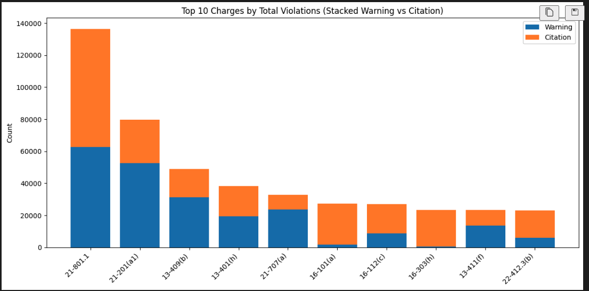
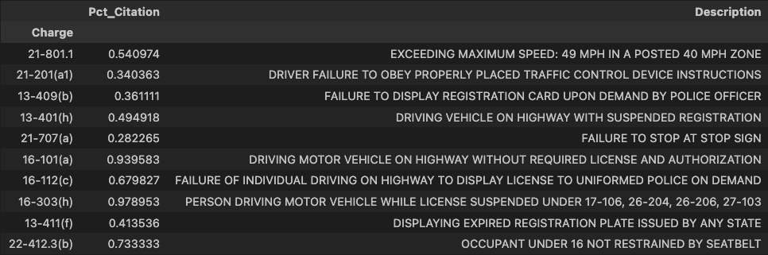
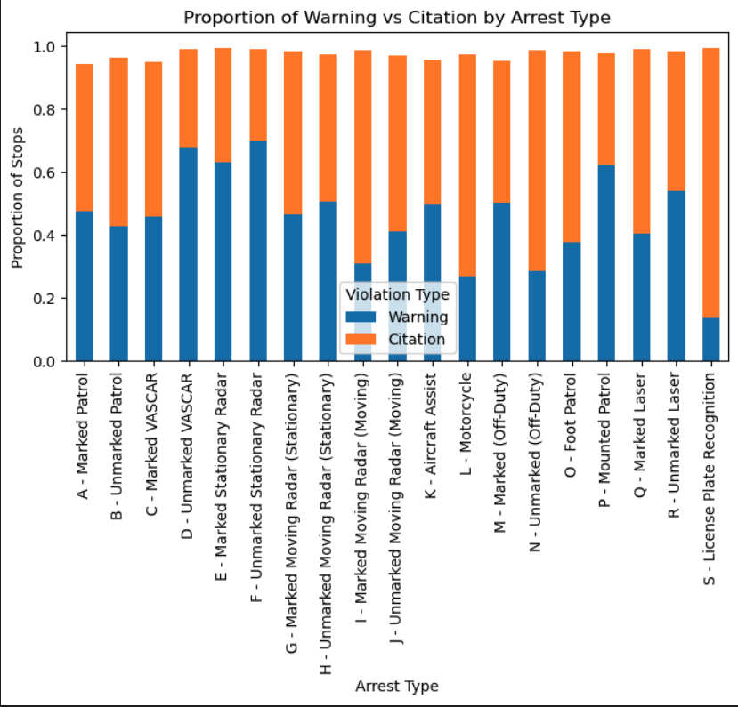
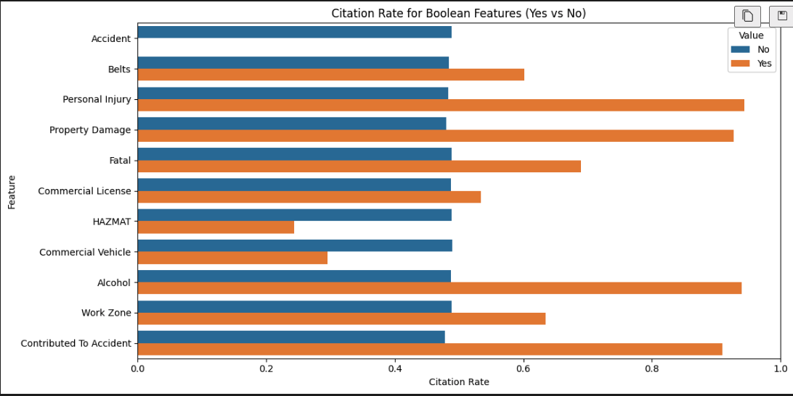

Group Members:
Jeremiah Liao
Kevin Diaz (kjdiaz@calpoly.edu)

# Traffic Violations Dataset

We are classifying whether a police officer will issue a citation or a warning for a given a traffic stop. The dataset we are using is provided by Montomery County of Maryland, published on the US Government's Data Catalog, which contains a running record of all electronic traffic violations issued in the county ([link](https://catalog.data.gov/dataset/traffic-violations)). For this project, however, we are taking a cleaned dataset from Kaggle with only the traffic violations spanning from 2014 to 2016. ([link](https://www.kaggle.com/datasets/felix4guti/traffic-violations-in-usa/data)).

### Structure

Each traffic violation has the following information recorded:
 - Driver & Car Description
    - Race
    - Gender
    - Driver City and State as specified on their Driver's License
    - Car Make
    - Car Model
    - Car Year
    - Car Color
 - Police Information
    - Agency & Sub Agency
    - Type of officer performing the arrest (Marked Patrol Vehicle, Unmarked Patrol Vechicle, etc)
 - Traffic Stop Information
    - Location
    - Date and Time
    - Situational Information (whether an accident, injury, alcohol, fatality, etc was involved)
 - Traffic Violation Information
    - The violation code the driver was charged with (ex: 21-209)
    - The description of the violation code
    - Violation Type (Warning vs Citation)

For this project, the `Violation Type` is what we will be classifying our data on.

## Summarize key variables, data volume, missigness, and potential target or interaction signals

### Data Cleaning

The following columns had missing data:
 - Longitude & Latitude, Geolocation
 - State
 - Car Year, Make, Model, Color
 - Article
 - Driver City and State

These data we could not find an easy way to fill in the missing data, so we just left them as is. Additionally, we do not expect on using many of these variables as they did not seem to have much significance on the violation type.

One column we did perform a lot of data cleaning on was the make of the car. There were many inconsistencies in the description of the car make. For example, "Hyundai" cars had abbreviated and mispelled values such as "Hyandai", "Hyundia", "Hyundi", and "Hynd". Therefore we had to create mappings from these values to the standard way of naming the car makes. Prior to cleanup we had 3129 unique values for make. „e were able to reduce the number down to 64 different makes. However, there were still 2620 records that we were unable to determine the related make, grouping those as `Unknown`. 

### Key Variables

One key variable we calculated and could serve as a potential indicator for likelihood for getting a warning vs a citation was the proportion of warnings and citations for a given charge. For each charge, we calculated the percentages that were warnings and the percentages that were citations. We noticed that for more serious charges such as DUIs, the percentage of warnings was close to 0 (why someone would still be let off with a warnings is a mystery), while other less serious charges such as stop lights not function resulted in a majority of warnings.

Below we show the top 10 charges with the amount of citations vs warnings and its associated description of the violation.

Another variable we think may help us determine the likelihood of a citation issued or a warning given is the arrest type. Below we see the distribution of citations vs warnings by each arrest type.

We can see that for some arrest types, such as License Plate Recognition, citations are almost always issued. This could be because its a more objective evaluation compared to human judgement. Or, citations are just issued automatically. Other interesting factors like why unmarked off duty officers issue more citations can be further researched into as well. Ultimately, we need more information regarding the situation of each traffic stop as this shows an aggregate. For example, we could see that unmarked off duty officers tend to be apart of more serious traffic stops, thus explaining the higher citation rate.

The boolean flags in the dataset could also help with determining likelihood of citations given. At a first glance, the column seems too sparse to be significant. For example, many DUI related infractions had a value of `No` for Alcohol. However, when looking at non-DUI related charges alongside the presence of Alcohol, we see that the citation rate increases dramatically. The same can be said for all the other boolean flags.

## Initial ideas and anticipated challenges

Given our data exploration. The most likely direction we will head towards for classifying whether a traffic stop would result in a citation or a warning would be the charge issued to the driver. It is clear some of the more serious charges such as DUIs would result in citations issued compared to a minor infraction. What would be interesting to explore is within a given category of violations, such as speeding, how likely it would be to get a citation vs warning, looking at factors such as the drivers record or the features related to the police officer to determine outcome. However that data is not present, so it would be difficult to accurartely classify citation vs warning for each charge type