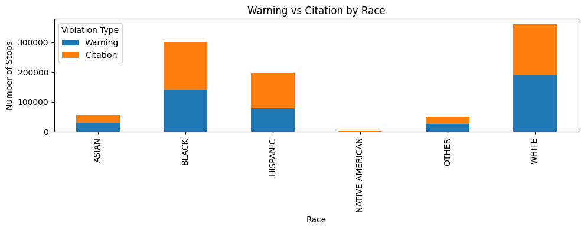
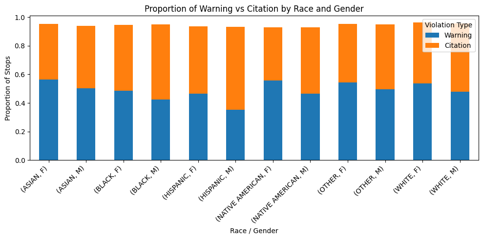
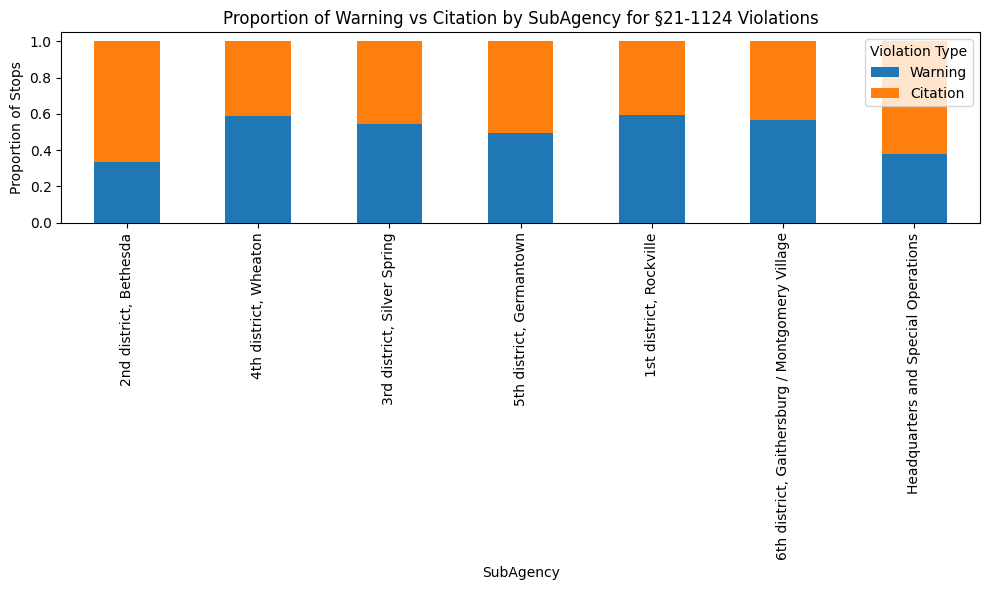
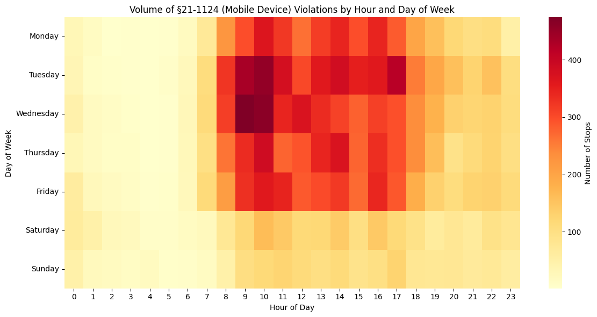
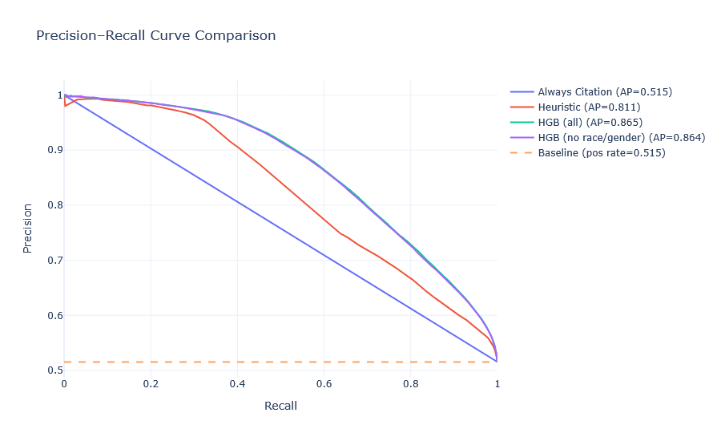
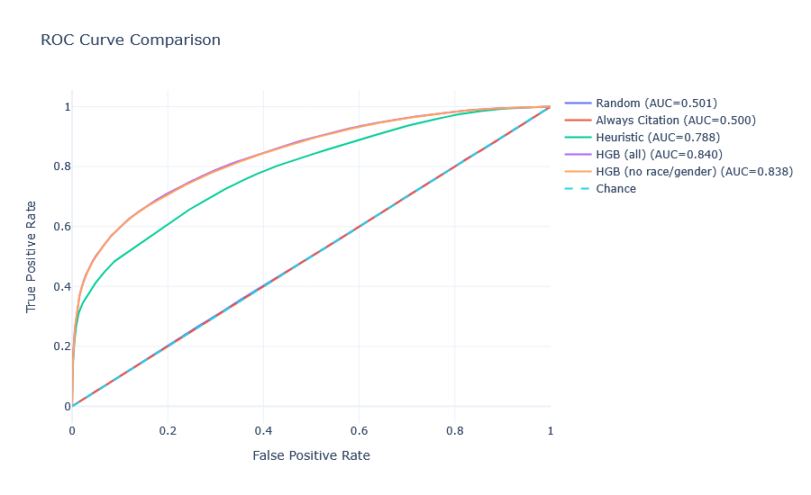

Jeremiah Liao (jjliao@calpoly.edu)
Kevin Diaz (kjdiaz@calpoly.edu)
# Predicting Traffic Citation Outcomes From Traffic Stop Data
## 1. Introduction

In this project, we investigate whether we can classify the outcome of a traffic stop as either a citation or a warning using only the administrative fields recorded by the officer during the stop. We want to know how well we can classify these outcomes, as well as how factors such as race or gender affect the model's effectiveness. We believe that through this analysis we can gain a better understanding of any unfair biases present in the data.

Our goal is to use the predictive performance of our model based on each feature used during training to determine which factors contribute the most to an officer's decision to issue a citation. Specifically, we compare a simple charge-based heuristic to a gradient-boosted model that uses a richer set of features, and then study what happens when contextual features such as race and gender are added or removed. Our results show that most of the model's predictive ability comes from the charge which the officer chose to cite or warn under. Additionally, a small number of contextual fields such as the time of day, day of the week, and location (closely tied to police subagency) also have a minor but noticeable effect. Race and gender, on the other hand, seem to have only a marginal impact on overall metrics despite notable disparities in citation rates across demographics, as shown below:

## 2. Data

### 2.1 Source and scope

The dataset we use originally comes from a publically released dataset of electronically logged traffic violations in Montgomery County, Maryland, and nearby areas. The data in this set spans from the beginning of 2012 to the end of 2016.

By restricting to only stops which resulted in a citation or a warning, and then filtering to the top 255 most common charges (out of almost 900) we are left with 954,440 rows in our dataset after cleaning. We focused on only the 255 most common charges because there were comparatively very few entries for the rest of the charges, and because our model (histogram gradient boosting) works most efficiently when categorical features are limited to 255 dimensions due to internal implementation details.

### 2.2 Data Cleaning & Feature Engineering

The original csv file contained 1,018,634 records. The data was already very clean, with very few missing values. For most missing values, we either filled it with an 'Unknown' label or imputed the value using other columns or mean values. 

An issue we encountered was the vehicle make and model, as well as the charge description. The `Make` column contained all sorts of abbreviations and misspellings of common makes. We were able to use fuzzy matching to narrow this down to 63 different makes, with under three thousand records left as 'unknown'. 

The `VehicleType` column had some minor data errors with some duplicate values referring to the same vehicle type. (For example, "18 - Police Vehicle" and "18 - Police (Non-Emerg)" referred to the same vehicle type). To fix this, we extracted the numerical code referring to the vehicle type and remapped it to a standard vehicle type name.

Two areas we considered doing feature engineering was text based analysis on the description and reducing the dimensionality of categories with high value counts such as `Charge`. However, most were either deemed irrelevant (`Charge` was closely associated with `Description`) or did not improve the model. As a result, most numerical columns were left as is while categorical columns were one hot encoded. One exception was the date and time column, where we converted it into a timestamp and extracted the day and hour for analysis of citation issuance patterns on a weekly basis.

### 2.3 Features used

The target label is `Violation Type`, with a 0 representing warning and a 1 representing citation.

We use the following features:

- `Charge`: the traffic article violation as determined by the officer
- `Arrest Type`: How the violation was identified or the stop initiated (e.g, marked patrol, license plate recognition, laser, etc).
- `SubAgency`: The district which the police officer belongs to
- `VehicleType`: Automobile, motorcycle, bus, RV, etc.
- `Race`, `Gender`: Demographic information
- `dayofweek`, `hour`: the day of the week and the time of the stop.
- `Latitude`, `Longitude`: The precise geolocation of the stop.

We include features such as charge, location, and time of day, as these features indicate the severity of the violation and danger it poses to other drivers on the road. DUI charges will likely have a higher likelhood of a citation issued compared to running a stop sign because it presents a greater danger to other drivers. (This was also reflected in our exploratory data analysis). While spatial and temporal features may indicate traffic conditions at the time of the violation. We hypothesize that the greater the danger, the higher the chances a citation is issued.

To examine potential officer bias, we also include driver-specific features such as race, gender, and vehicle type. Subagency may reveal differences in local enforcement culture or practices.

To illustrate this, the following figure shows that there are clear race and gender disparities in citation rates:

We also observe meaningful variation in citation rates across police districts:

And for certain charges, time-of-week patterns are also visible:

We also include some boolean columns
- `Personal Injury`, `Commercial License`, `Alcohol`. `Property Damage`, etc.

These columns give further insight into the traffic incident, such as whether the driver had alcohol or contributed to an accident. 

Upon initial glance, these columns appear to be irrelevant. Only a small fraction of all rows contain a true value for any column, with some seemingly contradicting the issued charge. For example, most DUI charges do not have the `Alcohol` field marked, while a non-DUI charge such as speeding may have that field marked. We take this to be a sign that in general, officers are ignoring these check boxes when logging a traffic stop. However, upon further analysis, the presence of such fields, even if rare, does almost always indicate a citation. Still, since they are so rare they had almost no impact on model performance.

## 3. Methods

### 3.1 Train/Test Split

We split the data using a random 80/20 train test split with sklearn's implementation of the `train_test_split` method. In this instance, we could use a random split since we did not need to account for any temporal leakage. We did not use any temporal features aside from generic time of day/day of week. Our classification did not depend solely on previous data either as the goal of this analysis was to determine effect of certain factors on the results. Using sklearn's built in `stratify` parameter also allowed us to maintain the original class distribution. 

### 3.2 Models

We compared 3 models for classifying the outcome of a traffic stop - a baseline model, a heuristic model, and a historgram gradient boosting classifier.

 - **Baseline Model**: Our baseline model is a classifier that always predicts that a traffic stop will result in a citation issued. We use this as our baseline to see how well more complex models can identify the instances where a warning may be given for a traffic stop.

 - **Heuristic Model**: This model uses the mean citation rate for a given charge as the probability of issuing a citation, with the treshold set at 0.5. During our intial analysis, we identified that the citation rates varied by the charge corresponding to the traffic stop. Our hypothesis was that the likelihood of citation issued would depend greatly on the charge type.

 - **Feature Based Model**: This model uses a Histogram-based Gradient Boosting Classification Tree algorithm on a dataset with all our selected features. We chose an ensemble decision tree method due to its ability to handle non linear relationships, crucial as our data was highly categorical. When compared to other decision tree methods such as Random Forest, this was more efficient, allowing us to iterate quickly over different sets of features to determine feature importance.

## 4. Evaluation & Analysis

### 4.1 Metrics

Being a classification problem, our primary metrics for evaluation were F1 Score and ROC-AUC. We use these metrics as this is a balanced dataset and we seel to determine the overall effectiveness of the model. Having a model that balances both precision and recall well gives the model credibility when analyzing which factors contribute to the result.

### 4.2 Results

Overall, the Histrogram Gradient Boosting Classifier performed the best, with a ROC-AUC score of 0.840 and a F1 score of 0.744. The Heuristic Model performed fairly well too, with a ROC-AUC score of 0.788 and a F1 score of 0.696. The Always Citation

### 4.3 Interpretation

While both models performed well in their classifications, the minimal improvement the feature based model had over the heuristic model showcases how significant the charge plays in the predictions. 

The more robust features did contribute to an increased model performance, however they only provided minimal impact. This differed from our prior hyotheses, and seemingly indicated no presence of bias in citation rate, even if rates did differ across ceratin demographics. 

One potential explanation for this contradiction could be that certain demographic features could be encoded in the charge. The dataset provides little insight into justification of a specific charge. Therefore it is possible that officers are taking other features such as race or gender imto account when assigning a charge. An example is modifying the amount of speed exceeded to a more or less severe charge type. Without additional data, we cannot determine this.

## 5. Conclusion

Our work has shown that while predictive models can be moderately effective at distinguishing between citations and warning, they are limited by the available administrative fields recorded during traffic stops. Most of the predictive power in our models comes from the charge the officer assigns, which highlights how important that decision is. However, the minimal improvements when adding the rest of the avilable features suggest that the reasoning behind the officer's decision is not sufficiently captured in the available data.

The charge field itself may already encode biases. Each charge has subsections for varying degrees of severity. More severe offences naturally have higher citation rates. So, if an officer is influenced by other factors such as race or gender when deciding on the severity of the charge then this column would hide those contextual biases. Without access to richer contextual data we cannot determine if these decisions are fair or justified.

This highlights the need for more oversight in how traffic stops are documented. Police officers should be required to provide explanations for their charge assignments in a more standardized way. They should also be instructed to not ignore the contextual features that are already included, but are sadly left blank in most records.

