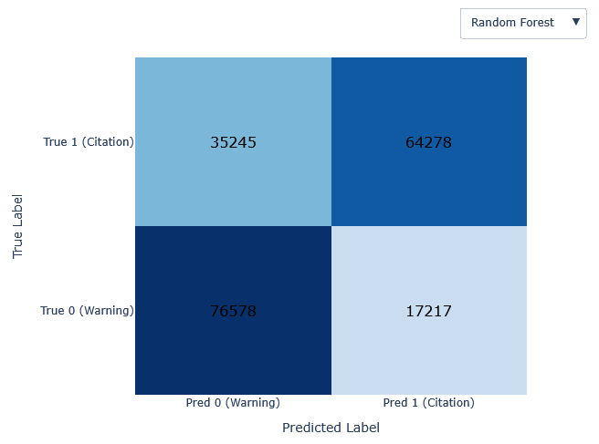
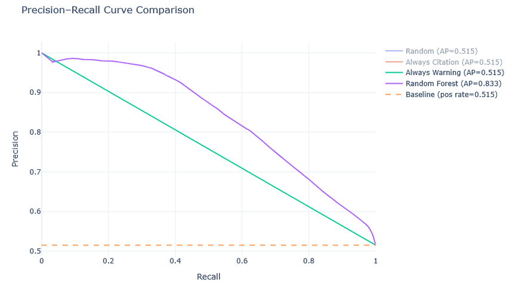
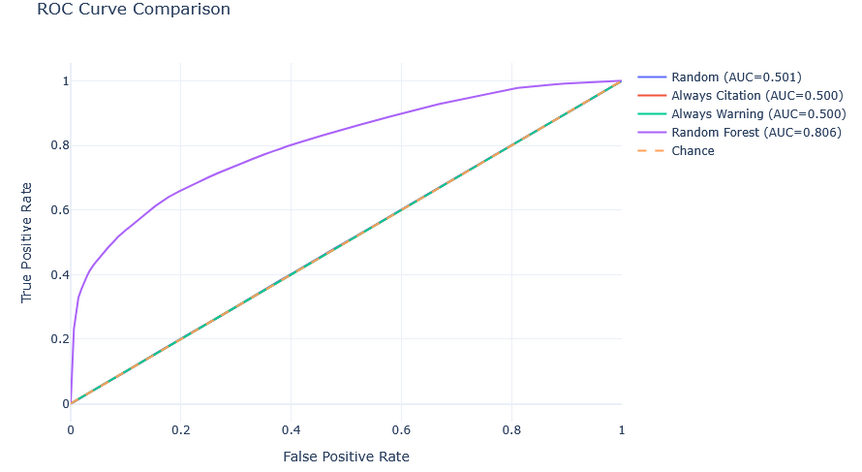

Group Members:
Jeremiah Liao
Kevin Diaz (kjdiaz@calpoly.edu)

For our initial draft we focused on building a few baseline classifiers and outlining how we plan to engineer features moving forward. The goal of this classifier is to take the attributes of a traffic stop and determine whether it results in a citation or a warning.

We compared four models: a random baseline, an “always citation” model, an “always warning” model, and a random forest classifier.

| Model               | Accuracy  | F1 Score                 | ROC AUC   |
| ------------------- | --------- | ------------------------ | --------- |
| **Random**          | 0.498     | 0.506                    | 0.500     |
| **Always Citation** | 0.515     | 0.680 (for class 1 only) | 0.500     |
| **Always Warning**  | 0.485     | 0.000                    | 0.500     |
| **Random Forest**   | **0.729** | **0.710**                | **0.806** |

The dataset has around a 52% citation rate, so always predicting citations gets roughly 50% accuracy. Its F1 score of 0.680 comes from always predicting the majority class, since recall is 100% for citations and precision is just the proportion of citations in the data. Since it can never predict warnings, the F1 score is misleading for these baselines.

In contrast, our initial Random Forest model shows meaningful discriminative power.

From the confusion matrix, we can see that the model distinguishes warnings from citations reasonably well for a first attempt. It seems to perform better on citations overall, since a larger proportion of warnings are being misclassified when compared to citations.

Both the PR and ROC curves are clearly above their respective baselines, which indicates that the model is actually learning useful structure in the data. Because these early results look promising, we believe we’ll be able to build a fairly effective recommender once we do some feature engineering.

There is still a lot of room for error, though. For many charges, whether a warning or citation is issued appears to depend heavily on officer discretion. These borderline cases are the ones that would be interesting to predict, but we only have limited information about the factors an officer may consider.

We already have some ideas for feature engineering to capture some of these missing signals. During our EDA we observed that citation rate varies throughout the day and across days of the week for certain charges, such as speeding, so including time-of-day and day-of-week features is a clear next step.

We also suspect the location of the stop matters. A violation on a highway might be treated differently than one in a residential or low-traffic area. To capture this, we can try to cluster the latitude/longitude data. Hopefully this would isolate highways vs residential areas, and we an then use those clusters as features.

Vehicle type also seems relevant. Motorcycles and large trucks appear to have higher citation rates, and we’re currently cleaning up the vehicle type column to verify this. If it is, then we could also include it as a feature.

Finally, each traffic stop includes a description field. We’re not yet sure whether officers write these descriptions themselves or choose from a predefined list. If the descriptions vary withing the same charge, then extracting information using TF-IDF or sentiment analysis could help capture some of the human factors behind citation decisions.

As for trying additional algorithms, we may explore models that train faster or handle categorical data natively, such as `HistGradientBoostingClassifier` in scikit-learn. Since most of our features are categorical or binary, this could simplify preprocessing and potentially improve performance. Having so many categorical features is proving to be a challenge, since features such as car make and model have hundreds of distinct values. We are trying to clean these columns up to reduce the dimensionality, since we have notices that a lot the variety is coming from typos or abbreviations.